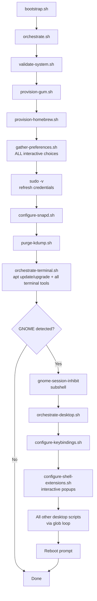
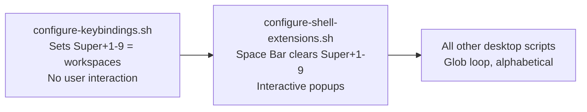

# Contributing to JustBuntu

There are many ways to participate in this project.

## Reporting Issues

- [Submit bugs and feature requests](https://github.com/itsnin/justbuntu/issues)
- Use the appropriate issue template when creating a new report

## Code Contributions

- Review [source code changes](https://github.com/itsnin/justbuntu/pulls)
- Submit pull requests with bug fixes or new features

Before contributing code, please read [AGENTS.md](AGENTS.md), which describes the project's design philosophy, architecture, code style, and verification discipline. All contributions are expected to follow those guidelines.

## Documentation

Review the documentation and submit corrections or improvements.

## Architecture Overview

## Desktop Phase Ordering

Keybindings and extensions run in a specific order because extensions may override base shortcuts:

## Pull Request Checklist

- All shell scripts pass `bash -n` syntax check
- Comments are lowercase with no punctuation unless meaning requires it
- No references to forbidden project names anywhere
- No `sudo` added to commands that do not require it
- No `sudo` removed from commands that genuinely need it
- Newly installed components have corresponding uninstall scripts
- Tested on Ubuntu 26.04 LTS or equivalent
