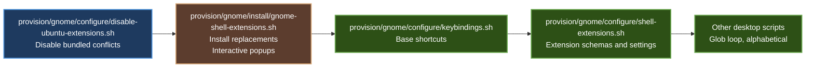

# Contributing to JustBuntu

There are several ways to contribute to this project. All contributions are appreciated.

## Ways to Contribute

1. **[Report bugs or request features](#reporting-issues)**
2. **[Submit code changes](#code-contributions)**
3. **[Improve documentation](#documentation)**
4. **[Review pull requests](https://github.com/itsnin/justbuntu/pulls)**

---

## Reporting Issues

Before filing a new issue, please search existing issues to avoid duplicates. If you find a matching report, upvote it or add a comment with your specific context.

When reporting a bug, include:
- Ubuntu version and architecture
- Whether you are running GNOME or a different desktop environment
- Relevant redacted log output from `~/.local/state/justbuntu/install.log`
- Steps to reproduce the problem

Issue templates are provided to guide you through the necessary information.

| Issue Type | Where to File |
|------------|--------------|
| Installation failures, provisioning bugs, feature requests | [GitHub issues](https://github.com/itsnin/justbuntu/issues) |
| Security vulnerabilities | See [SECURITY.md](./SECURITY.md) for private reporting |

---

## Code Contributions

### Before You Start

1. **File or find an issue** — This gives us a chance to provide feedback before you invest time.
2. **Read the standards** — [AGENTS.md](./AGENTS.md) routes contributors to the project contract and relevant skills under `.agent/skills/`. All contributions are expected to follow these guidelines.
3. **Fork and clone** the repository.

### Development Workflow

1. Create a feature branch from `main`
2. Make your changes
3. Verify:
   ```bash
   # Syntax check all shell scripts
   find . -name "*.sh" -exec bash -n {} \;

   # Lint with ShellCheck
   find . -name "*.sh" -exec shellcheck {} +
   ```
4. Test on Ubuntu 26.04 LTS or equivalent
5. Submit a pull request

### Pull Request Checklist

- [ ] All shell scripts pass `bash -n` syntax check
- [ ] ShellCheck passes, or each warning is understood and justified
- [ ] Comments follow the project style — sentence case, proper nouns capitalized, light punctuation, explain why not what
- [ ] Maximum three consecutive comment lines without intervening code
- [ ] No references to forbidden project names anywhere in code or docs
- [ ] No `sudo` added to commands that do not require it
- [ ] No `sudo` removed from commands that genuinely need it
- [ ] Newly provisioned components have corresponding revert scripts
- [ ] New scripts start with `#!/usr/bin/env bash` and `set -euo pipefail`
- [ ] Tested on Ubuntu 26.04 LTS or equivalent

---

## Architecture Overview

```mermaid
flowchart TD
    %% Color definitions — readable in both light and dark mode
    classDef entry fill:#1e3a5f,stroke:#4a90d9,stroke-width:2px,color:#ffffff
    classDef core fill:#2d5016,stroke:#6aa84f,stroke-width:2px,color:#ffffff
    classDef interactive fill:#5c3d2e,stroke:#d4a373,stroke-width:2px,color:#ffffff
    classDef terminal fill:#3d1f5c,stroke:#9b7cc9,stroke-width:2px,color:#ffffff
    classDef desktop fill:#1f4d4d,stroke:#5fb3b3,stroke-width:2px,color:#ffffff
    classDef decision fill:#5c1a1a,stroke:#c95a5a,stroke-width:2px,color:#ffffff
    classDef done fill:#333333,stroke:#777777,stroke-width:2px,color:#ffffff

    A[bootstrap.sh]:::entry --> B[install.sh]:::core
    B --> C[validate-system.sh]:::core
    C --> D[install/prerequisites/gum.sh]:::core
    D --> E[gather-preferences.sh<br/>All interactive choices]:::interactive
    E --> F{GNOME detected?}:::decision
    F -->|Yes| G[disable-ubuntu-extensions.sh<br/>before replacement install]:::desktop
    G --> H[install/gnome-shell-extensions.sh<br/>Interactive popups]:::interactive
    F -->|No| I[sudo -v<br/>Refresh credentials]:::core
    H --> I
    I --> J[Homebrew, apps, and system changes]:::core
    J --> K[core/terminal.sh<br/>terminal tools]:::terminal
    K --> L{GNOME detected?}:::decision
    L -->|No| M[Done]:::done
    L -->|Yes| N[gnome-session-inhibit<br/>subshell]:::desktop
    N --> O[core/desktop.sh<br/>keybindings and post-install config]:::desktop
    O --> P[Remaining GNOME install modules]:::desktop
    P --> Q[Reboot prompt]:::interactive
    Q --> M
```



---

## Desktop Phase Ordering

GNOME replacement extensions run in a specific order because their interactive
installation and dependent settings have different requirements. Ubuntu's
bundled extensions are disabled immediately before replacement installation.
Base keybindings and extension-specific settings run afterward, once the
relevant extension files and schemas exist.



---

## Documentation

Documentation improvements are always welcome. This includes:
- The [README](./README.md)
- This contributing guide
- [AGENTS.md](./AGENTS.md) — design philosophy and standards
- The [documentation site](https://itsnin.github.io/justbuntu)

---

## Thank You

Thank you in advance for your contribution. Every bug report, documentation fix, and code change helps make JustBuntu better for everyone.
